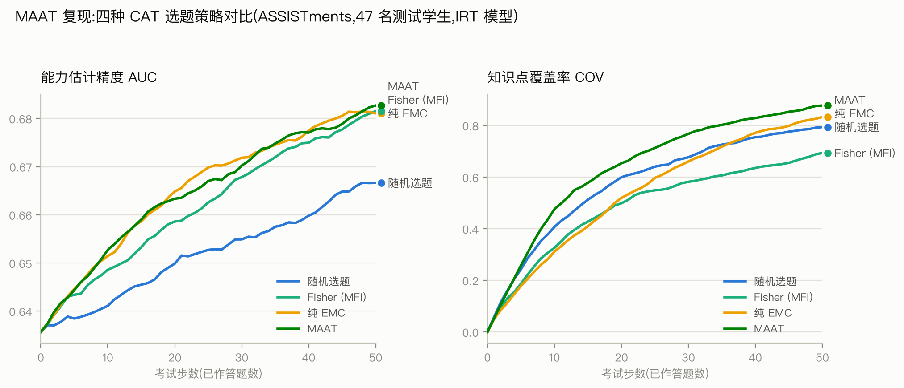

# MAAT 代码全解:从数据到实验结果

> 逐层讲解 MAAT(ICDM 2020)官方仓库 `pyat` 的全部代码,含我们补写的三个基线策略与复现实验结果。阅读顺序即代码的执行顺序:数据 → 模型 → 策略 → 主循环 → 脚本 → 结果。

## 0. 全局地图:论文与代码的对应关系

先建立总图景。MAAT 论文提出"质量 + 多样性 + 重要性"三模块选题框架,代码的对应情况:

| 论文组件 | 代码位置 | 状态 |
|---|---|---|
| 认知诊断模型 IRT | `pyat/model/irt_model.py` | 原有 |
| 质量模块(EMC,式 7–9) | `irt_model.py` 的 `expected_model_change()` | 原有 |
| 多样性模块(IWKC 贪心,式 5–6) | `pyat/strategy/maat_strategy.py` | 原有,但无权重($w_k \equiv 1$) |
| 重要性模块(式 10–15) | — | **论文未开源** |
| 随机基线 | `pyat/strategy/random_strategy.py` | **我们补写** |
| Fisher 信息量基线(MFI) | `pyat/strategy/fisher_strategy.py` | **我们补写** |
| 纯 EMC 消融 | `pyat/strategy/expected_model_change_strategy.py` | **我们补写** |
| NCD 模型 | 仅剩 `models/ncd/checkpoint.pt` 权重 | 源码缺失 |

目录结构:

```
26_MAAT/
├── datasets/
│   ├── assistment/            # 数据:triplets.csv 等
│   └── data_prep.py           # 数据划分工具
├── models/irt/checkpoint.pt   # 作者预训练的 IRT 题目参数
├── pyat/                      # 核心包
│   ├── utils/data/            # 三个数据集类
│   ├── model/                 # IRT 模型 + 抽象接口
│   ├── strategy/              # 四个选题策略 + 抽象接口
│   └── driver.py              # 自适应测试主循环
├── scripts/
│   ├── train.py               # 离线预训练 IRT
│   └── test.py                # 四策略对比实验
└── results/                   # 实验输出(日志、csv、图)
```

整个系统做的事,一句话:**模拟一场"机器出题的考试"**——对每个测试学生,策略从他做过的题里一道道地"出题",模型根据他的真实作答实时更新能力估计,每步记录估计准不准(AUC)和知识点铺得开不开(COV)。

## 1. 数据层

### 1.1 原始数据格式

`datasets/assistment/` 下三个文件:

**`triplets.csv`** —— 作答三元组,一行一条记录:

```
student_id,question_id,correct
0,4,1        # 0 号学生做对了 4 号题
0,7,0        # 0 号学生做错了 7 号题
```

**`concept_map.json`** —— 每道题考哪些知识点:`{"7": [1], "12": [2], ...}`。

**`metadata.json`** —— 规模信息:1473 个学生、903 道题、22 个知识点、58427 条记录;其中 1426 人做训练(历史学生)、47 人做测试(模拟考生)。

划分逻辑在 `data_prep.py` 的 `split_data_by_student()`:**按学生切**,测试学生的全部记录都留作考试模拟(记录太少、撑不满一场 50 题考试的学生不能进测试集)。这里的关键设计:模拟考试时,策略只能从该学生**真实做过的题**里选——因为只有这些题我们才知道他的真实对错。

### 1.2 三个数据集类(`pyat/utils/data/`)

**`_Dataset`(基类)**:把三元组列表重组成嵌套字典 `{学生id: {题目id: 对错}}`,方便按学生查询;构造时断言所有 id 已重编号为从 0 起的连续整数(因为后面要当 Embedding 的下标用)。

**`TrainDataset`**:多继承 `_Dataset` 和 `torch.utils.data.Dataset`,补上 `__getitem__`/`__len__`,就能直接喂给 PyTorch 的 `DataLoader` 做批训练。

> 踩坑记录:原版 `__getitem__` 还返回每道题的知识点列表,但不同题的知识点数量不同,新版 torch 的默认 collate 拼不了变长列表,直接 `RuntimeError`。该字段训练循环根本不用,我们已删掉。

**`AdapTestDataset`**:考试模拟的核心状态机。在 `_Dataset` 之上为每个学生维护两个集合:

- `untested`:还没被出过的题(初始 = 他做过的全部题);
- `tested`:已出过的题(有序,`deque`)。

三个关键方法:`apply_selection(sid, qid)` 把一道题从未测移到已测(即"这道题出给他了");`reset()` 全部归零(换策略重跑前调用);`get_tested_dataset(last=True)` 把已测题转成 `TrainDataset`——`last=True` 只取每人**最近一道**,因为每步更新只需要增量训练刚作答的题。

## 2. 模型层:IRT

### 2.1 数学形式

`irt_model.py` 里的 `IRT(nn.Module)` 是最经典的二参数 IRT(项目反应理论):

$$P(\text{学生 } i \text{ 答对题 } j) = \sigma(\alpha_j \cdot \theta_i + \beta_j)$$

三组参数全部用 `nn.Embedding` 存(本质就是可训练的查表):

- $\theta_i$:学生能力(`num_dim` 维,实验里取 1 维);
- $\alpha_j$:题目区分度——$\alpha$ 大,能力差一点点答对概率就差很多,题"区分"人;
- $\beta_j$:题目难度(准确说是易度,越大越容易答对)。

`forward(student_ids, question_ids)` 就是逐元素实现上式:查表 → 点积 → 加偏置 → sigmoid。

### 2.2 IRTModel:围绕 IRT 的完整生命周期

外层 `IRTModel(AbstractModel)` 封装了模型在两个阶段的全部操作。**离线阶段**(考试前):

- `adaptest_train()`:用 1426 个历史学生的全部记录训练,交叉熵损失,Adam 优化,$\theta, \alpha, \beta$ 一起学;
- `adaptest_save()`:**只保存 $\alpha, \beta$**。这是理解整个系统的关键——题目参数是从历史数据学到的"共识",可以复用;而 $\theta$ 是学生个体参数,测试学生是全新的人,他们的 $\theta$ 必须在考试中从零估计。

**在线阶段**(考试中):

- `adaptest_preload()`:加载预训练的 $\alpha, \beta$(`strict=False` 允许 $\theta$ 缺失,保持随机初始化);
- `adaptest_update()`:每出一道题、拿到作答后调用。注意优化器只挂 `theta` 的参数——**题目参数在考试中冻结**,只更新这个学生的能力估计。这就是 CAT 的"自适应":能力估计随作答逐步修正,下一步选题又基于新估计;
- `adaptest_evaluate()`:算两个指标。**AUC**——用当前 $\theta$ 预测该学生数据里全部题的对错,和真实对错算 ROC-AUC,衡量"只考了 $t$ 道题时,能力估计对他整体表现的预测力";**COV**——已测题覆盖的知识点数 / 他涉及的全部知识点数。

### 2.3 质量模块:expected_model_change()

论文式 (7)–(9) 的实现,也是全库计算量最重的函数。思想:**好题 = 能让模型学到最多东西的题**,用"假设他答了这道题,能力估计会挪多远"来量化:

```python
# 冻结题目参数,只允许 theta 动
original = theta.clone()
假设答对,梯度训练 8 步   ->  pos_weights;  theta 恢复原值
假设答错,梯度训练 8 步   ->  neg_weights;  theta 恢复原值
p = 当前模型预测的答对概率
EMC = p * ||pos_weights - original|| + (1-p) * ||neg_weights - original||
```

两种假设按预测概率加权——不知道他会答对还是答错,就取期望。EMC 大的题,无论他答对答错,都会显著修正能力估计,信息量大;EMC 趋近 0 的题(比如对他来说太简单、模型笃定他会对的题)考了白考。

这个函数每次调用要做 16 步梯度更新,而每一步选题要对每个学生的每道候选题各调一次:47 人 × 平均 172 道未测题 × 50 步 ≈ 40 万次调用,是实验耗时(约 20 分钟)的绝对大头。

## 3. 策略层:四种选题逻辑

所有策略实现同一个接口(`abstract_strategy.py`):`adaptest_select(model, adaptest_data) -> {学生id: 题目id}`,即"给每个学生选下一道题"。这就是"模型无关"(Model-Agnostic)的含义:策略只通过 `expected_model_change` 这类通用接口和模型打交道,底下换成 NCD、DKT 都不用改策略代码。

### 3.1 RandomStrategy(补写)

从未测集合随机挑一道。所有对比的地板线。

### 3.2 FisherStrategy(补写)

传统 CAT 五十年来的标准做法(MFI, Maximum Fisher Information)。IRT 下 Fisher 信息量有闭式解:

$$I_j(\theta) = \alpha_j^2 \, p_j(\theta)\,(1 - p_j(\theta)), \qquad p_j(\theta) = \sigma(\alpha_j \theta + \beta_j)$$

每步选 $I_j(\theta)$ 最大的题。直觉:$p \approx 0.5$(难度贴着当前能力)且区分度高的题信息量最大。注意它靠 `get_theta/get_alpha/get_beta` 直接读 IRT 参数,**不是**模型无关的——这正是论文拿它当靶子的原因之一。

> 踩坑记录:`get_beta()` 返回形状 `(1,)` 的数组而非标量,直接参与运算会在 `float()` 处报 `TypeError`,补写时用 `beta[0]` 取标量。

### 3.3 ExpectedModelChangeStrategy(补写)

MAAT 去掉多样性模块的消融版:每步直接 `argmax` EMC,不管知识点覆盖。用于回答"多样性模块究竟贡献了什么"。

### 3.4 MAATStrategy(原有,核心)

两级筛选,每步:

1. **质量模块**:对全部未测题算 EMC,取前 `n_candidates=10` 道当候选——先保证"这 10 道都是信息量大的好题";
2. **多样性模块**:在 10 道候选里,选**知识点覆盖增益**最大的一道。

覆盖增益 `_compute_coverage_gain()` 实现论文式 (5)(6) 的无权重版:

$$\text{gain}(q) = \frac{1}{|K_s|} \sum_{k \in K_s} \frac{cnt(k)}{cnt(k) + 1}$$

其中 $cnt(k)$ 是"已测题 + 候选题 $q$"覆盖知识点 $k$ 的次数。$\frac{cnt}{cnt+1}$ 是关键设计:从 0 次到 1 次收益 $\frac{1}{2}$,从 1 到 2 次只多 $\frac{1}{6}$——**边际收益递减**,逼着策略去覆盖还没考过的知识点,而不是在同一个点上反复出题。论文证明了该函数是单调次模的,贪心选择有 $(1-1/e)$ 的近似保证。

论文完整版里每个知识点还要乘重要性权重 $w_k$(由式 10–15 的测试效应嵌入算出),开源代码没有这部分,等价于 $w_k \equiv 1$。如果将来要补上,只需把求和改成 `w[c] * cnt/(cnt+1)` 一处。

## 4. 驱动层:driver.py 主循环

`AdapTestDriver.run()` 把上面所有东西串成一场考试:

```
第 0 步:theta 还是随机值,先评估一次(基线)
for t in 1..50:
    selected = strategy.adaptest_select(model, data)   # 每人选一道题
    data.apply_selection(...)                          # 题移入已测(等于拿到真实作答)
    model.adaptest_update(data)                        # 用新作答更新 theta
    results = model.adaptest_evaluate(data)            # 记录 AUC / COV
```

我们给它加了返回值:每步的指标列表,供脚本落盘成 csv。

## 5. 脚本层

**`scripts/train.py`**:读 `train_triplets.csv` → 训练 IRT 100 轮 → 存 `models/irt/checkpoint.pt`。仓库已带训练好的 checkpoint,复现时不必重跑。

**`scripts/test.py`**:实验入口。要点:

- 四个策略依次跑,**每个策略跑前重置随机种子并 `test_data.reset()`**——保证每个策略面对的 $\theta$ 初始化和考试状态完全相同,对比才公平;
- 配置:`num_dim=1`,学习率 0.0025,每次更新 8 轮,考试长度 50 步,CPU;
- 每跑完一个策略就把逐步指标追加写入 `results/<时间戳>/results.csv`,中途中断不丢已完成的结果。

运行方式(必须在 `scripts/` 目录下,脚本用相对路径找数据):

```bash
cd scripts && ../.venv/bin/python test.py
```

## 6. 复现结果

ASSISTments 数据,47 名测试学生,IRT 模型,考 50 题,CPU 约 21 分钟:



| 策略 | AUC@10 | AUC@50 | COV@10 | COV@50 |
|---|---|---|---|---|
| 随机选题 | 0.6411 | 0.6666 | 0.407 | 0.794 |
| Fisher (MFI) | 0.6486 | 0.6815 | 0.326 | 0.694 |
| 纯 EMC | 0.6515 | 0.6811 | 0.312 | 0.833 |
| **MAAT** | **0.6527** | **0.6827** | **0.476** | **0.878** |

论文三个核心主张全部复现:

1. **精度不亏**:MAAT / 纯 EMC / Fisher 的 AUC 终值几乎重合(0.681–0.683),都明显高于随机——加多样性模块不牺牲能力估计精度;
2. **传统 CAT 的病**:Fisher 覆盖率全程垫底,50 步才 0.694,比随机还低 10 个百分点——信息量大的题挤在少数区分度高的知识点上,这正是论文的动机;
3. **多样性模块的贡献**:MAAT 覆盖率全程领先,前 10 步优势最大(0.476,纯 EMC 只有 0.312)——贪心覆盖在考试早期就把主要知识点铺开;纯 EMC 前 20 步的覆盖率和 Fisher 一样差,说明单靠质量模块,覆盖全凭运气。

## 7. 复现时修的问题清单

| 问题 | 原因 | 修法 |
|---|---|---|
| `import pyat` 直接 ImportError | 官方仓库缺 `random_strategy.py`、`expected_model_change_strategy.py`、`ncd_model.py`,`__init__.py` 却在 import | 补写前两个 + Fisher 基线;NCD 的 import 注释掉 |
| DataLoader 报 "each element in list of batch should be of equal size" | `TrainDataset.__getitem__` 返回变长知识点列表,新版 torch 默认 collate 拼不了 | 不再返回该字段(训练循环本来就不用) |
| Fisher 策略 `TypeError: only 0-dimensional arrays...` | `get_beta()` 返回形状 `(1,)` 数组 | 取 `beta[0]` 标量 |

另有两点与论文的已知差距,属官方开源本身的缺失而非复现误差:重要性模块(式 10–15)未实现(等价 $w_k \equiv 1$);NCD 模型源码缺失,无法复现论文的"模型无关"第二组实验。
