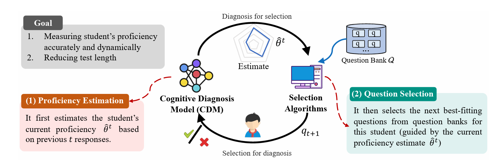

# 计算机化自适应测试：一个 Python 库

<!-- **<font size=5>计算机化自适应测试工具包，包含以下模型和策略。</font>** -->

这个 Python 库为快速开发计算机化自适应测试（CAT）系统提供了简化的解决方案。它整合了一套全面的工具，融合了传统统计方法和最新的机器学习与深度学习技术。

[](https://pypi.org/project/EduCAT/)
[](https://github.com/bigdata-ustc/EduCAT/blob/main/LICENSE)

## ❗ 什么是 CAT？

**计算机化自适应测试（CAT）** 是教育实践与计算技术结合最早、最成功的案例之一。

CAT 是一个学生与测试系统之间的动态交互过程。如果说传统的纸笔测试是"一刀切"，那么 CAT 就是"因人而异"。每个学生都会得到一份根据其能力和知识水平定制的个性化测试，确保每道题都能准确评估和挑战学生。CAT 根据每位学生的能力水平量身选择题目，从而在最小化测试长度的同时最大化评估精度。

CAT 系统分为两个主要组件，轮流执行：
1. **认知诊断模型（CDM）**：作为用户模型，首先根据认知科学或心理测量学，利用学生之前的答题记录来估计其当前能力
2. **选题算法**：根据特定标准从题库中选择下一道题

这两个步骤重复进行，直到满足预定的停止规则，最终估计的能力水平（即诊断报告）将反馈给学生，作为此次评估的结果或为后续学习提供指导。



## ⚡ 主要贡献

本仓库实现了 CAT 的基本功能，包含三种类型的认知诊断模型（CDM）：项目反应理论（IRT）、多维项目反应理论（MIRT）和神经认知诊断（NCD）。每种 CDM 都有对应的选题算法：

### IRT：项目反应理论
| 算法 | 英文名 | 说明 |
|------|--------|------|
| MFI | Maximum Fisher Information | 最大费舍尔信息策略 |
| KLI | Kullback-Leibler Information | KL 散度信息策略 |
| MAAT | Model-Agnostic Adaptive Testing | 模型无关自适应测试策略 |
| BECAT | Bounded Ability Estimation Adaptive Testing | 能力边界估计自适应测试策略 |
| BOBCAT | Bilevel Optimization-Based CAT | 双层优化计算机化自适应测试策略 |
| NCAT | Neural CAT | 神经计算机化自适应测试策略 |

### MIRT：多维项目反应理论
| 算法 | 英文名 | 说明 |
|------|--------|------|
| D-opt | D-Optimality | D 最优性策略 |
| MKLI | Multivariate Kullback-Leibler Information | 多元 KL 散度信息策略 |
| MAAT | Model-Agnostic Adaptive Testing | 模型无关自适应测试策略 |
| BOBCAT | Bilevel Optimization-Based CAT | 双层优化计算机化自适应测试策略 |
| NCAT | Neural CAT | 神经计算机化自适应测试策略 |

### NCD：神经认知诊断
| 算法 | 英文名 | 说明 |
|------|--------|------|
| MAAT | Model-Agnostic Adaptive Testing | 模型无关自适应测试策略 |
| BECAT | Bounded Ability Estimation Adaptive Testing | 能力边界估计自适应测试策略 |

---

**注意**：数据在使用前需要进行处理。在 `scripts/dataset` 目录下，我们提供了 ASSISTment 数据集的预处理脚本供参考。

## ⚡ 安装

使用本项目前，请按以下步骤安装：

**从 Git 源码安装（推荐）：**
```bash
pip install -e .
```

**或从 PyPI 安装：**
```bash
pip install EduCAT
```

## 快速开始

请查看 `scripts` 目录下的示例代码：

- `train.ipynb` - 训练示例
- `test.ipynb` - 测试示例
- `bobcat_train.py` - BOBCAT 训练脚本

## 工具

### 可视化

默认使用 `tensorboard` 来可视化每次迭代的奖励，请参考 `scripts` 中的演示，并使用以下命令查看可视化结果：

```bash
tensorboard --logdir /path/to/logs
```

## 📕 基于机器学习的方法

### 🔍 认知诊断模型（CDM）

认知诊断模型（CDM）作为用户模型，首先根据认知科学或心理测量学，利用学生之前的答题记录来估计其当前能力。

### ✏️ 选题算法

选题算法根据特定标准从题库中选择下一道题。大多数传统的统计标准是信息量指标，例如选择与学生当前能力估计相匹配的题目难度，意味着学生大约有 50% 的概率答对。该过程重复进行，直到满足预定的停止规则，最终估计的能力水平（即诊断报告）将反馈给学生。

---

## 📚 相关论文

### 2023 - 2024

- BETA-CD：用于个性化学习的贝叶斯元学习认知诊断框架 [论文](https://dl.acm.org/doi/10.1609/aaai.v37i4.25629)
- 自监督图学习用于长尾认知诊断 [论文](https://arxiv.org/abs/2210.08169)
- 用于自适应学习系统的深度强化学习 [论文](https://arxiv.org/abs/2004.08410)
- 具有解耦学习选择器的的新型计算机化自适应测试框架 [论文](https://link.springer.com/article/10.1007/s40747-023-01019-1)
- Gmocat：一种图增强的多目标计算机化自适应测试方法 [论文](https://arxiv.org/abs/2310.07477)
- 利用图神经网络和强化学习实现可扩展的自适应学习 [论文](https://arxiv.org/abs/2305.06398)
- 通过对比预训练全面理解数学问题 [论文](https://arxiv.org/abs/2301.07558)
- 基于学习者画像和知识图的适应性电子学习系统 [论文](https://ieeexplore.ieee.org/document/10164957/)
- 计算机化自适应测试的能力边界估计 [论文](https://openreview.net/pdf?id=tAwjG5bM7H)
- 计算机化自适应测试中准确性与安全性的平衡 [论文](https://arxiv.org/abs/2305.18312)
- 高效搜索的计算机化自适应测试 [论文](https://dl.acm.org/doi/10.1145/3583780.3615049)

### 2022-2023

- Hiercdf：基于贝叶斯网络的分层认知诊断框架 [论文](https://dl.acm.org/doi/10.1145/3534678.3539486)
- 用于预测学生表现的深度认知诊断模型 [论文](https://www.sciencedirect.com/science/article/pii/S0167739X21003277)
- 计算机化自适应测试：马尔可夫决策过程统一方法 [论文](https://link.springer.com/chapter/10.1007/978-3-031-10522-7_40)
- 全自适应框架：在线教育的神经计算机化自适应测试 [论文](https://ojs.aaai.org/index.php/AAAI/article/view/20399)
- NAPLAN 结果延迟是关于政治还是精确度？ [论文](https://blog.aare.edu.au/is-the-naplan-results-delay-about-politics-or-precision/)
- 教育中的算法公平性 [论文](https://arxiv.org/abs/2007.05443)
- 教育题目检索中的鲁棒计算机化自适应测试方法 [论文](https://dl.acm.org/doi/abs/10.1145/3477495.3531928)
- 用于更快自适应教育评估的自注意力门控认知诊断 [论文](https://ieeexplore.ieee.org/document/10027634/)

### 2021-2022

- 用于认知诊断的项目反应排序 [论文](https://www.ijcai.org/proceedings/2021/241)
- Rcd：智能教育系统的关系图驱动认知诊断 [论文](https://dl.acm.org/doi/10.1145/3404835.3462932)
- Bobcat：基于双层优化的计算机化自适应测试 [论文](https://www.ijcai.org/proceedings/2021/0332.pdf)
- 计算机化自适应测试中选题的多目标优化 [论文](https://dl.acm.org/doi/10.1145/3449639.3459334)
- 在线教育系统中层次多标签分类的一致性感知多模态网络 [论文](https://ieeexplore.ieee.org/document/9667767/)

### 2020-2021

- 智能教育系统的神经认知诊断 [论文](https://arxiv.org/abs/1908.08733)
- 质量与多样性：模型无关的计算机化自适应测试框架 [论文](https://ieeexplore.ieee.org/abstract/document/9338437/)

### 2019-2020

- Dirt：用于认知诊断的深度学习增强项目反应理论 [论文](https://dl.acm.org/doi/10.1145/3357384.3358070)
- 鲁棒计算机化自适应测试 [论文](https://link.springer.com/chapter/10.1007/978-3-030-18480-3_15)
- 强化学习应用于自适应分类测试 [论文](https://link.springer.com/chapter/10.1007/978-3-030-18480-3_17)
- 利用认知结构进行自适应学习 [论文](https://arxiv.org/abs/1905.12470)
- 医学考试多项选择题的题目难度预测 [论文](https://dl.acm.org/doi/10.1145/3357384.3358013)
- 基于注意力循环网络的层次多标签文本分类方法 [论文](https://dl.acm.org/doi/abs/10.3357384.3357885)
- Quesnet：异构测试题的统一表示 [论文](https://arxiv.org/abs/1905.10949)

### 2019 年之前

- 自适应学习的推荐系统 [论文](https://journals.sagepub.com/doi/full/10.1177/0146621617697959)
- 标准测试阅读题目的难度预测 [论文](https://dl.acm.org/doi/10.1145/3357384.3298437)
- 使用 CATSIB 检测偏见题目以提高计算机自适应测试的公平性 [论文](https://www.researchgate.net/publication/287052110_Detecting_biased_items_using_CATSIB_to_increase_fairness_in_computer_adaptive_tests)
- 基于知识结构的自适应测试算法评估与系统开发 [论文](https://www.researchgate.net/publication/266889340_Evaluating_Knowledge_Structure-based_Adaptive_Testing_Algorithms_and_System_Development)
- 项目反应理论在实际测试问题中的应用 [论文](https://www.semanticscholar.org/paper/Applications-of-Item-Response-Theory-To-Practical-Lord/d0476004085419b8a44953f5cdab11442c12ffaa)
- 支持多样化教育评估的自适应测试系统 [论文](https://www.sciencedirect.com/science/article/pii/S0360131508000973)

## 引用

如果本仓库对您的研究有帮助，请引用我们的工作：

```bibtex
@misc{liu2024survey,
      title={Survey of Computerized Adaptive Testing: A Machine Learning Perspective},
      author={Qi Liu and Yan Zhuang and Haoyang Bi and Zhenya Huang and Weizhe Huang and Jiatong Li and Junhao Yu and Zirui Liu and Zirui Hu and Yuting Hong and Zachary A. Pardos and Haiping Ma and Mengxiao Zhu and Shijin Wang and Enhong Chen},
      year={2024},
      eprint={2404.00712},
      archivePrefix={arXiv},
      primaryClass={cs.LG}
}
```
